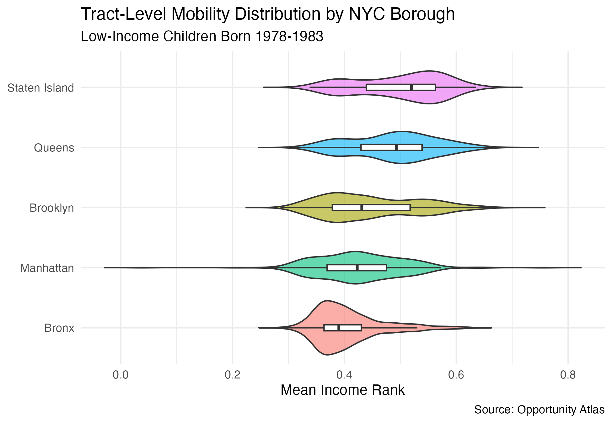
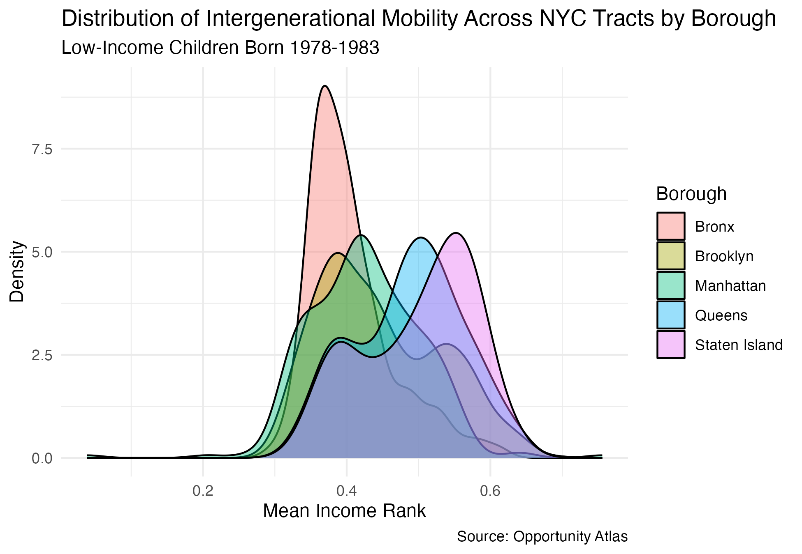
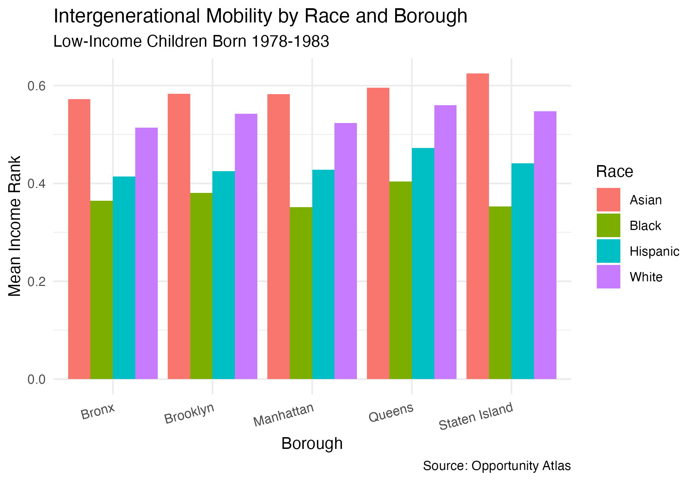
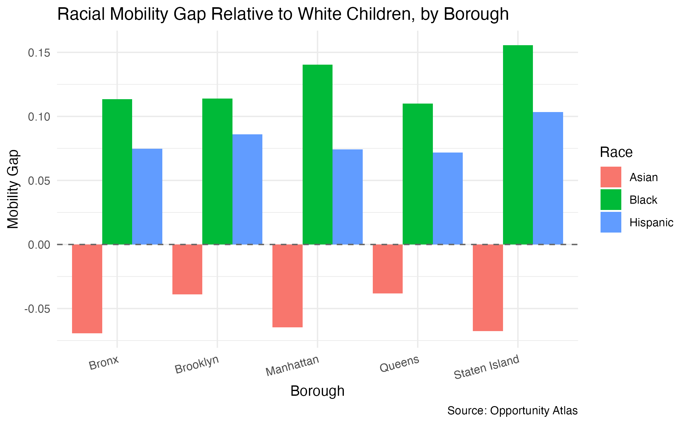
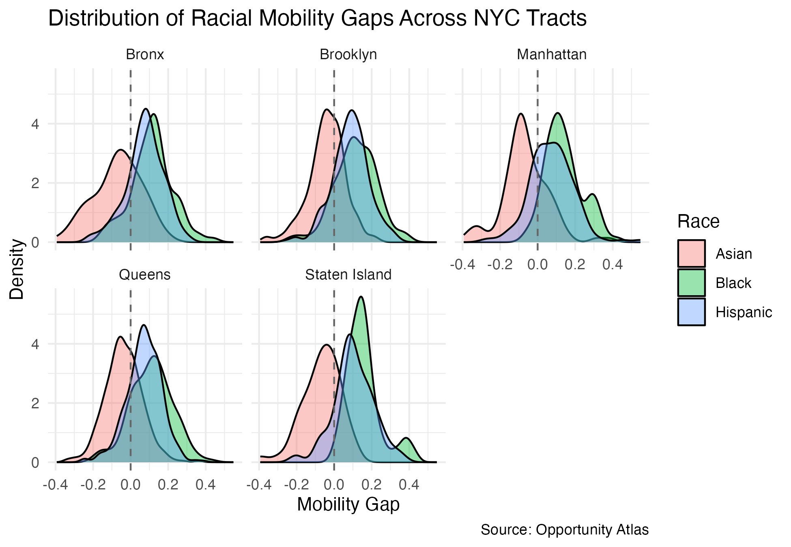

```{r setup}
library(tidyverse)
library(tidycensus)
library(ggplot2)
library(haven)
library(readxl)
library(kableExtra)
library(modelsummary)

# Load saved outputs from analysis.Rmd
nyc_tracts <- readRDS("output/nyc_tracts.rds")
borough_summary <- readRDS("output/borough_summary.rds")
gap_summary <- readRDS("output/gap_summary.rds")
city_summary <- readRDS("output/city_summary.rds")
model1 <- readRDS("output/model1.rds")
model2 <- readRDS("output/model2.rds")
model3 <- readRDS("output/model3.rds")
```

# 1 Introduction

New York City is often considered a place where ambition and hard work can overcome the circumstances of birth. But the data tell a more complicated story. For children born into low-income families in the late 1970s and early 1980s, the neighborhood they grew up in had profound consequences for their long-run economic futures, and those consequences were not distributed equally across race. As someone from New York City and a first-generation, low-income student, I find these patterns academically interesting to study, but also personally concerning. The question of whether place shapes one's opportunity differently by race is the lived experience of millions of children who grew up in the same city, but at the same time, in very different worlds.

This paper asks two related descriptive questions. First, how do intergenerational mobility outcomes vary across NYC's five boroughs and Census tracts for children raised in low-income families? Second, how large are racial gaps in mobility between Black, Hispanic, Asian, and white children within and across NYC neighborhoods?

This is a **descriptive study**. The goal is to document patterns in the data, rather than to establish causal relationships. The mobility outcomes examined here reflect the experiences of one historical cohort (children born between 1978 and 1983), who grew up before NYC's Universal Pre-K program launched in 2014 and before many of the neighborhood investments of the 1990s and 2000s took effect. Whether the gaps documented here have narrowed for more recent cohorts is an important question that this data cannot answer.

From my analysis, there seemed to be three main findings:

1. Intergenerational mobility for low-income children varies substantially across NYC's five boroughs, with Staten Island and Queens producing the highest average outcomes and the Bronx consistently the lowest.

2. Racial gaps in mobility are large across all five boroughs, with Black and Hispanic children raised in low-income families achieving significantly lower adult income ranks than white children raised in the same neighborhoods and with the same parental income. 

3. Asian children consistently outperform white children in every borough, a finding that complicates simple narratives about privilege, proximity, and disadvantage that deserves further investigation.

# 2 Data

## 2.1 The Opportunity Atlas

The primary data source for this paper is the Opportunity Atlas, which is a publicly available dataset produced by Raj Chetty, Nathaniel Hendren, Maggie Jones, and Sonya Porter at Opportunity Insights (Chetty et al., 2018). The Atlas provides tract-level estimates of long-run economic outcomes for children born between 1978 and 1983, constructed by linking federal income tax records, Census data, and other administrative records. It covers every Census tract in the United States and is one of the most comprehensive sources of neighborhood-level intergenerational mobility data available.

## 2.2 Load and Filter the Data
```{r, echo=TRUE}
# Load Opportunity Atlas data
tract_outcomes <- read_dta("data/raw/tract_outcomes.dta")

# NYC Dataset
nyc_tracts <- tract_outcomes %>%
  
  # Filter to NYC
  mutate(city = case_when(
    state == 36 & county %in% c(5, 47, 61, 81, 85) ~ "New York City", 
    TRUE ~ NA_character_)) %>%
  filter(city == "New York City") %>%
  
  # Add borough label from county code
  mutate(borough = case_when(
    county == 5  ~ "Bronx",
    county == 47 ~ "Brooklyn",
    county == 61 ~ "Manhattan",
    county == 81 ~ "Queens",
    county == 85 ~ "Staten Island")) %>%
  
  # Select vars
  select(
    borough, city, state, county, tract,
    
    # Pooled mobility at p25 parental income (main outcome)
    kfr_pooled_pooled_p25, 

    # By race at p25
    kfr_white_pooled_p25,
    kfr_black_pooled_p25,
    kfr_hisp_pooled_p25,
    kfr_asian_pooled_p25,
    
    # Unconditional means by race
    kfr_pooled_pooled_mean,
    kfr_white_pooled_mean,
    kfr_black_pooled_mean,
    kfr_hisp_pooled_mean,
    kfr_asian_pooled_mean,

    # Secondary outcomes
    kfr_pooled_pooled_p1,
    kfr_top20_pooled_pooled_p25,
    jail_pooled_pooled_p25,
    teenbrth_pooled_female_p25,
    two_par_pooled_pooled_p25,
    lpov_nbh_pooled_pooled_p25) %>%
  
  # Create outcome gap vars (compare to white)
  mutate(
    gap_black = kfr_white_pooled_p25 - kfr_black_pooled_p25,
    gap_hispanic = kfr_white_pooled_p25 - kfr_hisp_pooled_p25,
    gap_asian = kfr_white_pooled_p25 - kfr_asian_pooled_p25)
```

## 2.3 Unit of Observation and Sample

The unit of observation is the Census tract, meaning a small, relatively stable geographic unit designed to capture neighborhoods of roughly 1,200 to 8,000 people. The NYC sample contains `r nrow(nyc_tracts)` Census tracts across the five boroughs: the Bronx (`r nrow(nyc_tracts %>% filter(borough == "Bronx"))` tracts), Brooklyn (`r nrow(nyc_tracts %>% filter(borough == "Brooklyn"))` tracts), Manhattan (`r nrow(nyc_tracts %>% filter(borough == "Manhattan"))` tracts), Queens (`r nrow(nyc_tracts %>% filter(borough == "Queens"))` tracts), and Staten Island (`r nrow(nyc_tracts %>% filter(borough == "Staten Island"))` tracts).

## 2.4 Key Variables


### 2.4.1 Primary Outcome Variables
The main outcome variable is the mean percentile rank in the national household income distribution, measured in 2014–2015, for children whose parents were at the 25th percentile of the national parental income distribution. This variable tells us where children who grew up in a given neighborhood with low-income parents, where end up in the national income distribution as adults. A higher values would indicate better upward mobility.

This paper also uses race-specific versions of this outcome, separately for white, Black, Hispanic, and Asian children, which will allow us to make direct comparisons of mobility outcomes across racial groups within the same neighborhood while holding parental income constant. Racial mobility gaps are computed as the difference between white and non-white outcomes at the tract level.

### 2.4.2 Secondary Outcome Variables
Several secondary outcomes are also examined at the borough level, such as the probability of reaching the top income quintile, the incarceration rate on April 1 2010, the teen birth rate for low-income girls, and the fraction of children raised by two parents. To protect privacy, the Opportunity Atlas adds a small amount of noise to each tract-level estimate. Estimates for racial subgroups in tracts with small populations may be missing or imprecise, which is reflected in the varying number of non-missing observations across racial groups.

## 2.5 Summary Statistics

```{r, fig.cap="Summary statistics for key variables across NYC Census tracts. Mobility variables are mean income percentile ranks at age ~35 for children with parents at the 25th income percentile. Gap variables are white minus other group. Source: Opportunity Atlas (Chetty et al., 2018)."}
nyc_tracts %>%
  select(
    kfr_pooled_pooled_p25,
    kfr_white_pooled_p25,
    kfr_black_pooled_p25,
    kfr_hisp_pooled_p25,
    kfr_asian_pooled_p25,
    gap_black,
    gap_hispanic,
    gap_asian,
    jail_pooled_pooled_p25,
    teenbrth_pooled_female_p25,
    two_par_pooled_pooled_p25) %>%
  rename(
    "Pooled Mobility (p25)" = kfr_pooled_pooled_p25,
    "White Mobility (p25)" = kfr_white_pooled_p25,
    "Black Mobility (p25)" = kfr_black_pooled_p25,
    "Hispanic Mobility (p25)" = kfr_hisp_pooled_p25,
    "Asian Mobility (p25)" = kfr_asian_pooled_p25,
    "Black-White Gap" = gap_black,
    "Hispanic-White Gap" = gap_hispanic,
    "Asian-White Gap" = gap_asian,
    "Incarceration Rate" = jail_pooled_pooled_p25,
    "Teen Birth Rate" = teenbrth_pooled_female_p25,
    "Two-Parent Rate" = two_par_pooled_pooled_p25) %>%
  pivot_longer(everything(), names_to = "Variable", values_to = "value") %>%
  group_by(Variable) %>%
  summarise(
    N = sum(!is.na(value)),
    Mean = round(mean(value, na.rm = TRUE), 3),
    SD = round(sd(value, na.rm = TRUE), 3),
    Min = round(min(value, na.rm = TRUE), 3),
    Median = round(median(value, na.rm = TRUE), 3),
    Max = round(max(value, na.rm = TRUE), 3),
    .groups = "drop") %>%
  kable(booktabs = TRUE) %>%
  kable_styling(latex_options = c("hold_position", "scale_down", "striped"), font_size = 9)
```

# 3 Analysis

## 3.1 Borough-Level Mobility

```{r, fig.cap="Intergenerational mobility outcomes by NYC borough for low-income children born 1978–1983. Mobility columns report mean, median, and standard deviation of the tract-level income rank outcome. Secondary outcomes are tract-level means aggregated to the borough. The Bronx is the reference category in subsequent regressions."}
borough_summary %>%
  arrange(desc(mean_mobility)) %>%
  mutate(across(where(is.numeric), ~round(., 3))) %>%
  kable(col.names = c("Borough", "Mean", "Median", "SD",
                      "Prob. Top 20%", "Incarceration",
                      "Teen Birth", "Two-Parent", "# Tracts"),
    booktabs = TRUE) %>%
  kable_styling(latex_options = c("hold_position", "scale_down", "striped"), font_size = 9) %>%
  add_header_above(c(" " = 1, "Mobility" = 3, "Secondary Outcomes" = 4, " " = 1))
```

Table 2 displays the mean mobility outcomes by borough, and it seems clear that there are significant differences. Staten Island produces the highest mean mobility for low-income children, followed by Queens, Brooklyn, Manhattan, and then the Bronx. The secondary outcomes agree with this, too, as the Bronx has the highest incarceration and teen birth rates of any borough, while Staten Island and Queens have the lowest. But because these are averages, we need to look at the within-borough variation for a better understanding.

```{r, out.width="85%", fig.cap="Distribution of intergenerational mobility outcomes across NYC Census tracts by borough. Each violin shows the full distribution of tract-level mean income ranks for low-income children born 1978–1983. Boroughs are ordered by median mobility. Source: Opportunity Atlas (Chetty et al., 2018)."}

```

Now, Figure 1 shows the full distribution of tract-level mobility within each borough using violin plots. The Bronx distribution is compressed at the low end, with very few high-mobility tracts anywhere in the borough, and the distribution peaks sharply at the bottom. Manhattan shows the widest spread of any borough, reflecting the extreme neighborhood heterogeneity of the city's wealthiest borough. Staten Island and Queens show the highest median mobility and relatively compressed distributions, suggesting that they have more consistent outcomes across their neighborhoods. Brooklyn falls in the middle on both dimensions. It seems that a child's specific Census tract plays a part in these outcomes as well.

```{r, out.width="85%", fig.cap="Kernel density estimates of tract-level intergenerational mobility by borough. Each curve shows the distribution of mean income ranks across Census tracts for low-income children born 1978–1983. Source: Opportunity Atlas (Chetty et al., 2018)."}

```

Figure 2 shows the overlapping density distributions of mobility by borough. The distributions for the Bronx and Brooklyn are noticeably left-shifted relative to Staten Island and Queens, with the Bronx showing the most mass concentrated below the 0.45 income rank threshold. Manhattan's bimodal-looking distribution reflects the coexistence of very high- and very low-mobility neighborhoods within the same borough.

\newpage 

## 3.2 Racial Mobility Gaps

```{r, fig.cap="Racial mobility gaps by NYC borough. Mean mobility columns report average tract-level income rank for each racial group among children with parents at the 25th income percentile. Gap columns report white minus other group. Positive values indicate lower mobility than white children at the same parental income. Source: Opportunity Atlas (Chetty et al., 2018)."}
gap_summary %>%
  arrange(desc(mean_gap_black)) %>%
  mutate(across(where(is.numeric), ~round(., 3))) %>%
  kable(col.names = c("Borough",
                      "White", "Black", "Hispanic", "Asian",
                      "Black", "Hispanic", "Asian"),
    booktabs = TRUE) %>%
  kable_styling(latex_options = c("hold_position", "scale_down", "striped"), font_size = 9) %>%
  add_header_above(c(" " = 1, "Mean Mobility by Race" = 4, "Gap Relative to White" = 3))
```

Table 3 presents mean mobility by race and the racial gap relative to white children for each borough. The gaps are large and consistent, since across every borough, Black and Hispanic children raised in low-income families achieve substantially lower adult income ranks than white children raised in the same neighborhoods with the same parental income. Asian children, by contrast, consistently outperform white children in every borough, which is a finding that isn't fully explained sociologically or theoretically quite yet.

```{r, out.width="85%", fig.cap="Mean intergenerational mobility by race and borough for low-income children born 1978–1983. Each cluster of bars represents one borough. Mobility is the mean income percentile rank at age ~35 for children with parents at the 25th income percentile. Source: Opportunity Atlas (Chetty et al., 2018)."}

```

Figure 3 shows mean mobility by race and borough side by side. The consistent rank ordering (Asian above white, white above Hispanic, Hispanic above Black) is flagged immediately and stays true in every single borough. We do see that the absolute level of mobility differs across boroughs, such as the fact that all groups do better in Staten Island than the Bronx, but the ordering across racial groups does not seem to change.

```{r, out.width="85%", fig.cap="Racial mobility gaps relative to white children by NYC borough. Positive values indicate lower mobility than white children at the same parental income level. Negative values for Asian children indicate they outperform white children. Source: Opportunity Atlas (Chetty et al., 2018)."}

```

Figure 4 demonstrates racial gaps explicitly when we plot the difference between white and non-white mobility for each borough. Black children face the largest gap in every borough, ranging from approximately 10 to 15 percentile points below white children at the same parental income level. Hispanic children face a somewhat smaller but still substantial gap.

Staten Island (my home borough) shows the largest Black-white gap of any borough, but paired with the highest average mobility overall this might seem quite surprising. This data suggests that high average mobility in a borough does not translate into equitable outcomes across racial groups, which unfortunately agrees with my own anecdotal experience of growing up in a majority black and hispanic neighborhood on Staten Island that was often on the receiving end of lower community funds, education investment, and job opportunity than the rest of the majority-white island.

```{r, out.width="95%", fig.cap="Distribution of tract-level racial mobility gaps by borough. Positive values indicate lower mobility than white children at the same parental income level. Source: Opportunity Atlas"}

```

Figure 5 shows the full tract-level distribution of racial gaps within each borough as density plots. This is the richest view of the data. The Black-white gap distribution is almost entirely to the right of zero in every borough, meaning it is unlikely to find a Census tract in NYC where Black children achieve the same or better mobility than white children at the same parental income. The Hispanic-white gap distribution is similarly rightward-shifted but somewhat less extreme. The Asian-white gap distribution is centered near or below zero in every borough, confirming that the Asian mobility advantage is widespread across neighborhoods rather than driven by a few high-performing outlier tracts.

## 3.3 Regression Analysis

```{r, echo=TRUE}
model1 <- lm(kfr_pooled_pooled_p25 ~ borough, data = nyc_tracts)
model2 <- lm(gap_black ~ borough, data = nyc_tracts)
model3 <- lm(gap_hispanic ~ borough, data = nyc_tracts)
```

To assess whether borough differences in mobility and racial gaps are statistically meaningful, Table 4 presents OLS regressions at the tract level with borough indicators. The Bronx is our reference in all models, so each coefficient measures how much better or worse a given borough performs relative to the Bronx. Model 1 uses pooled mobility as the outcome, while Models 2 and 3 use the Black-white and Hispanic-white gaps respectively.

### 3.3.1 Model 1 

In Model 1, all four boroughs show statistically significantly higher pooled mobility than the Bronx. Staten Island's coefficient of 0.095 indicates that low-income children from Staten Island tracts end up approximately 9.5 percentile points higher in the national income distribution than comparable children from the Bronx. Queens follows closely, with a premium of approximately 8.2 percentile points over the Bronx, while Brooklyn (4.2 points) and Manhattan (2.0 points) show smaller but still significant premiums.

### 3.3.1 Models 2 and 3

Models 2 and 3 examine whether the racial gap itself differs systematically across boroughs. In Model 2, Staten Island shows a significantly larger Black-white mobility gap than the Bronx by being approximately 4.2 percentile points wider, so even though Staten Island produces the highest average mobility, it also produces the most racially unequal outcomes for Black children relative to white children. This is one of the more important findings from my analysis, as the borough where low-income children overall do best is also the borough where the disadvantage facing Black children relative to white children is most pronounced. For the Hispanic-white gap in Model 3, only Staten Island again shows a marginally significant difference of 2.9 percentile points. The modest R-squared values (0.134 for pooled mobility, 0.017 and 0.009 for the gap models) confirm that borough alone explains only a fraction of the variation across tracts, with the majority of variation occurring within boroughs rather than between them.

```{r, fig.cap="OLS regressions of mobility outcomes on borough indicators, tract level. Model 1 outcome is pooled mean income rank for low-income children. Models 2 and 3 outcomes are the Black-white and Hispanic-white mobility gaps respectively. Reference category is the Bronx. Standard errors in parentheses."}

modelsummary(
  list(
    "Pooled Mobility" = model1,
    "Black-White Gap" = model2,
    "Hispanic-White Gap" = model3),
  stars = TRUE,
  coef_rename = c(
    "boroughBrooklyn" = "Brooklyn",
    "boroughManhattan" = "Manhattan",
    "boroughQueens" = "Queens",
    "boroughStaten Island" = "Staten Island"),
  gof_map  = c("nobs", "r.squared"),
  notes = "Reference category: Bronx. * p < 0.1, ** p < 0.05, *** p < 0.01.",
  output = "kableExtra") %>%
  kable_styling(latex_options = c("hold_position", "scale_down", "striped"), font_size = 9)
```

# 4 Final Thoughts & Conclusions

This paper aimed to document two things: how intergenerational mobility varies across NYC's five boroughs and Census tracts for low-income children, and how large racial gaps in mobility are within and across those neighborhoods.

On the first question, we see how mobility varies substantially across boroughs. The Bronx produces the worst outcomes for low-income children by every measure examined (lowest mean income rank, highest incarceration rate, highest teen birth rate, and lowest probability of reaching the top income quintile), while Staten Island and Queens produce the best outcomes. From our visualizations, we saw that these are not just differences in means, as the violin plots reveal that the entire distribution of mobility shifts across boroughs, with the Bronx having almost no high-mobility tracts. Manhattan's extreme internal heterogeneity stands out as an obviously unique pattern, as a home to some of the highest- and lowest-mobility neighborhoods in the city, and as a reflection of its profound economic segregation.

On the second question, racial gaps are one of the most prominent findings from this dataset. Across every borough in NYC, Black and Hispanic children raised in low-income families achieve significantly lower adult income ranks than white children raised in the same neighborhoods with the same parental income. The Black-white gap is the largest and most consistent, ranging from approximately 15 to 20 percentile points across boroughs and present in nearly every Census tract in the city. Staten Island, which is the borough with the highest average mobility, also shows the largest Black-white gap, illustrating that high average outcomes and equitable outcomes are not the same thing. Asian children consistently outperform white children in every borough, a finding that complicates simple narratives about race and disadvantage and suggests that the mechanisms driving racial gaps in mobility are not uniform across groups.

## 4.1 Limitations

1. This is a descriptive study, meaning it documents associations, not causes. The finding that the Bronx produces lower mobility than Staten Island does not mean that growing up in the Bronx caused worse outcomes. Families sort into neighborhoods based on many pre-existing characteristics, and confounding factors may drive both neighborhood selection and long-run economic outcomes. 

2. The Atlas cohort was born between 1978 and 1983 and grew up before many of the major policy changes that have reshaped NYC, including the Universal Pre-K expansion of 2014, the rise and fall of stop-and-frisk policing, and significant neighborhood gentrification. These patterns may look different for children growing up in NYC today. 

3. Borough-level aggregation in the regression analysis can mask substantial within-borough heterogeneity. Future work should examine tract-level predictors of mobility and racial gaps more directly, incorporating neighborhood characteristics such as poverty rates, school quality, and racial composition from Census data. 

4. Tract-level estimates for racial subgroups are based on smaller samples and may be imprecise in neighborhoods with few children of a given race. 

5. Native American outcomes were excluded due to insufficient sample sizes in NYC tracts.

## 4.2 Next Steps

Next steps for this work could be adding neighborhood-level characteristics to explain why some tracts produce better mobility outcomes and smaller racial gaps than others. Tract-level data from the American Community Survey via the `tidycensus` package, including poverty rates, racial composition, median income, and educational attainment, could be merged with the Atlas data to support a richer multivariate analysis. A second important extension could be examining whether the racial gaps documented here have narrowed for more recent cohorts, which would require data not yet available at the tract level for younger birth years.

# 5 References

1. Chetty, Raj, Nathaniel Hendren, Maggie R. Jones, and Sonya R. Porter. 2018. "Race and Economic Opportunity in the United States: An Intergenerational Perspective." NBER Working Paper No. 24441. Data: Opportunity Atlas, opportunityinsights.org.

2. Chetty, Raj, Nathaniel Hendren, Patrick Kline, and Emmanuel Saez. 2014. "Where is the Land of Opportunity? The Geography of Intergenerational Mobility in the United States." *Quarterly Journal of Economics* 129(4): 1553–1623.